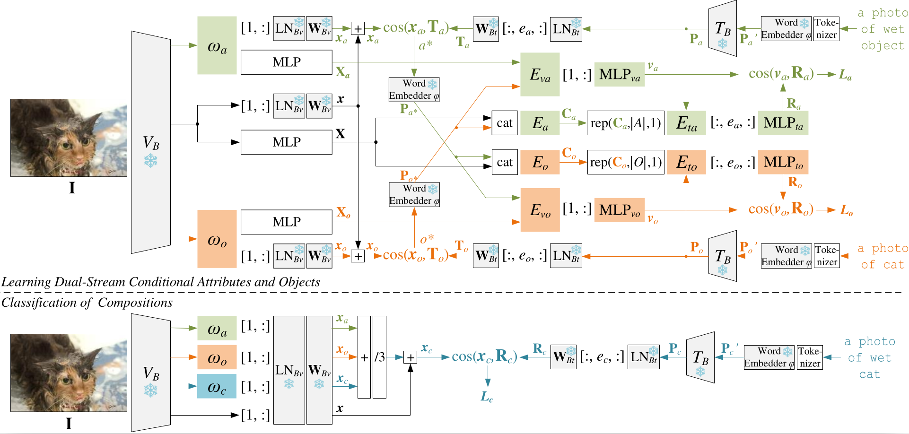

# Learning Dual-Stream Conditional Concepts in Compositional Zero-Shot Learning

> **Title:** Learning Dual-Stream Conditional Concepts in Compositional Zero-Shot Learning<br>
> **Authors:** Qingsheng Wang, Lingqiao Liu, Chenchen Jing, et.al.<br>
> **Publication:** IEEE Transactions on Pattern Analysis and Machine Intelligence (IEEE TPAMI), Vol. 47, No. 11, November 2025. <br>
> **Published Paper:** [https://ieeexplore.ieee.org/abstract/document/11141706/]

<p>

</p>

Thank you for reading our work.

We provide the pre-trained files for UT-Zappos50K, MIT-States, C-GQA, and VAW-CZSL in Google Drive. All pre-trained files are based on the frozen [pre-trained OpenAI CLIP model](https://openaipublic.azureedge.net/clip/models/b8cca3fd41ae0c99ba7e8951adf17d267cdb84cd88be6f7c2e0eca1737a03836/ViT-L-14.pt) in FP16 format. Please run *evaluation.py* to evaluate with the following downloaded *.pt* files. You may get slightly different results from the reported ones due to your hardwares and environments.

| Dataset      |Top-k|Seen|Unseen| HM | AUC| Size  | URL                                                                                               |
|--------------|-----|----|------|----|----|-------|---------------------------------------------------------------------------------------------------|
| UT-Zappos50K |Top-1|70.1| 76.2 |58.8|46.2|318.7MB| [Download](https://drive.google.com/file/d/1--6xHlqUxwFbaRAVZHjyItJVbiCZl_RH/view?usp=drive_link) |
| MIT-States   |Top-1|49.2| 52.4 |38.7|21.8|319.7MB| [Download](https://drive.google.com/file/d/1fGk0r2Cqi2MTOlsMKQk0SxAftN6G7se1/view?usp=drive_link) |
| C-GQA        |Top-1|42.6| 34.3 |30.1|12.7|321.7MB| [Download](https://drive.google.com/file/d/1hm81tZ3Cg6cNmtFVSNZTT0s_2B1vr9cW/view?usp=drive_link) |
| VAW-CZSL     |Top-5|42.5| 50.0 |32.6|15.6|321.4MB| [Download](https://drive.google.com/file/d/1EJytbpgPP7fr1uATbhqkaRwR7f_OQctD/view?usp=drive_link) |

If you find this work interesting please cite:

```
@ARTICLE{11141706,
  author={Wang, Qingsheng and Liu, Lingqiao and Jing, Chenchen and Wang, Peng and Zhang, Yanning and Shen, Chunhua},
  journal={IEEE Transactions on Pattern Analysis and Machine Intelligence}, 
  title={Learning Dual-Stream Conditional Concepts in Compositional Zero-Shot Learning}, 
  year={2025},
  volume={47},
  number={11},
  pages={10076-10093},
  keywords={Visualization;Semantics;Image recognition;Zero shot learning;Streaming media;Dairy products;Feature extraction;Computational modeling;Benchmark testing;Training;Compositional zero-shot learning;compositional generalization;tuning soft prompts;zero-shot learning},
  doi={10.1109/TPAMI.2025.3597668}}
```
